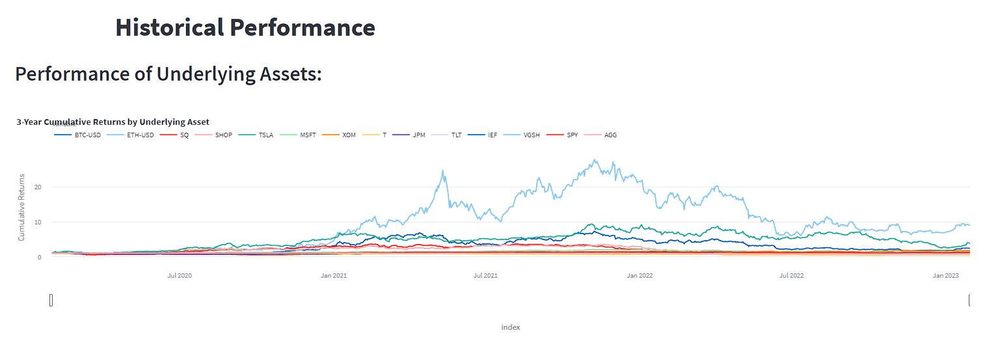
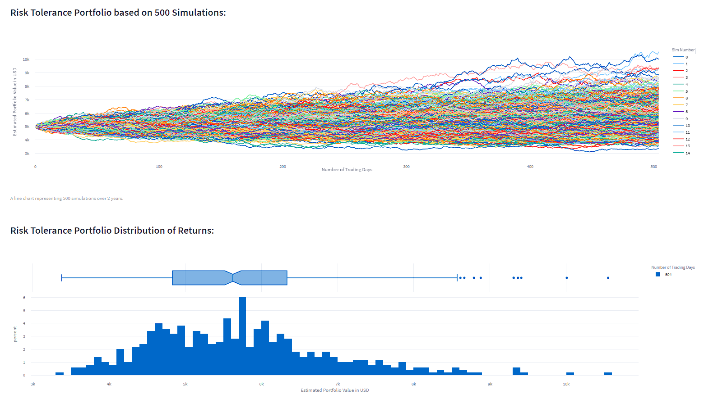

# Investment Advisor

### The Investment Advisor was developed to help empower potential investors by providing portfolio suggestions from just a few questions about income and attitude towards investment.The Investment Advisor application will assess an investor's risk tolerance and his/her's capacity to absorb risk. Based on those evaluations, two corresponding risk scores will be calculated and associated investment portfolios will be chosen from our ETFs offering. A third 'Cryptomix' portfolio including cryptocurrency assets will also be included. Their performance will be assessed and compared to the Benchmark portfolio of 40% Bonds 60% Stocks.

---


---

## Table of contents

1. [Technologies](#technologies)
2. [Installation Guide](#installation-guide)
3. [Usage](#usage)
4. [Contributors](#contributors)
5. [License](#license)

---

## Technologies

`Python 3.9`

`Jupyter lab`

_Libraries_

1. `Pandas` is a Python package that provides fast, flexible, and expressive data structures designed to make working with large sets of data easy and intuitive.

   - [pandas](https://github.com/pandas-dev/pandas) - for the documentation, installation guide and dependencies.

2. `PyViz` is a Python visualization package that provides a single platform for accessing multiple visualization libraries. The visualization libraries used in this application are listed below: <br/>

   - [PyViz ](https://pyviz.org/) - for guidance on how to start visualization, interactive visualization, styles and layouts customization.
   - [Plotly](https://plotly.com/) - is a library that allows developers to build interactive charts, tables and graphs from data.

3. `SQLAlchemy` is an open-source SQL library for Python. It is designed to ease the communication between Python-based programs and databases"

   - [SQLAlchemy ](https://www.sqlalchemy.org/) - for information on the library, its features and installation instructions.<br/>

4. `Streamlit` is a library that allows developers to build web applications with live user input.

   - [Streamlit](https://streamlit.io/) - to read more about deploying, installing and customizing.<br/>
   
5. `NumPy` is an open source library that adds computational tools to a project, including mathematical functions and random number generators.

   - [Numpy](https://numpy.org/) - to read about available functions and installation.<br/>
   
6. `Python-dotenv` is a library that adds functions to read locally stored .env files.

   - [python-dotenv](https://pypi.org/project/python-dotenv/) - to read about installation and usage.<br/>
   
7. `Alpaca` is a company that creates API-centered tools to trade stocks and buy cryptocurrency.

   - [Alpaca](https://alpaca.markets/) - to sign up and read about installation and usage.<br/>
   
 
---

## Installation Guide

To run this program the application must be started from the terminal using Streamlit.<br/> A .env file must also be written and stored in the local directory before running the program according to the instructions below.<br/> Once the installations below are completed and the .env file has been made, navigate to the folder containing the application and run the following command in your terminal to launch the program:

```python
streamlit run investment_app.py
```

Jupyter lab is the preferred software to work with this application.<br/> Jupyter lab is a part of the **[anaconda](https://www.anaconda.com/)** distribution package and therefore it is recommended to download **anaconda** first.<br/> Once downloaded, run the following command in your terminal to launch Jupyter lab:

```python
jupyter lab
```
### Creating the .env file
To create the .env file, open a .txt document and type in your keys from the Alpaca dashboard after creating an account in the following format:


Rename the text file to .env and save the file to the root directory after selecting 'All Files':


### Library Installations
Before using the application first install the following dependencies by using your terminal:

To install pandas run:

```python
pip install pandas
```

```python
# or conda
conda install pandas
```

To install the plotly visualization library, in Terminal run:

```python
pip install plotly==5.13.0
```

Confirm the installation of the plotly package by running the following command in Terminal:

```python
 conda list plotly
```

To install SQLAlchemy, in Terminal run:

```python
pip install SQLAlchemy
```

Confirm the installation of the SQLAlchemy package by running the following commands in Terminal:

```python
 conda list sqlalchemy
```

To install Streamlit, in Terminal run:

```python
pip install streamlit
```

Confirm the installation of the Streamlit package by running the following commands in Terminal:

```python
 conda list streamlit
```

To install python-dotenv, in Terminal run:

```python
pip install python-dotenv
```

Confirm the installation of the python-dotenv package by running the following commands in Terminal:

```python
 conda list python-dotenv
```

To install numpy, in Terminal run:

```python
pip install numpy
```

Confirm the installation of the numpy package by running the following commands in Terminal:

```python
 conda list numpy
```

To install the Alpaca Trade API, in Terminal run:

```python
pip3 install alpaca-trade-api
```

Confirm the installation of the Alpaca Trade API package by running the following command in Terminal:

```python
 conda list alpaca-trade-api
```
---

## Usage

> Application summary<br/>

The Investment Advisor tool helps investors make educated decisions based on their risk capacity and risk tolerance, just by asking a few questions.<br/>
Furthermore, Streamlit library transforms Investment Advisor into an interactive web application that nontechnical users without any coding experience can use.<br/> Answer a few questions about your income and attitude towards investment, and the application will provide three portfolio recommendations as well as a benchmark portfolio

- The analysis begins by asking the user some questions:<br/>
  <br/>
- Next, risk capacity and risk tolerance scores are calculated:<br/>
  <br/>
- The calculated portfolios can be compared side by side at a glance:<br/>
  <br/>
- You can find more details about each portfolio by using a dropdown menu:<br/>
  <br/>
- The historical performance of each asset is shown to the user in an interactive plot:<br/>
  <br/>
- Previous yearly returns and Sharpe Ratios can give users a quick overview of past portfolio performance:<br/>
  <br/>
- Cumulative returns of every portfolio over the past three years are shown in an overlay plot:<br/>
  <br/>
- A Monte Carlo simulation can be run on each portfolio selected, and the estimated returns will be displayed:<br/>
- A 95% confidence interval is calculated from the simulation, and displayed to the user along with the portfolio makeup:<br/>
  <br/>
- The simulated returns are plotted on two graphs, a line graph and a histogram that provide useful information such as the median, mode, and quartiles.
  <br/>
  
  

https://user-images.githubusercontent.com/118786747/215937383-553539c1-729f-4841-bf23-42f4d28b6825.mp4


  
> Getting started<br/>

- To use the Investment Advisor first clone the repository to your PC.<br/>
- Use `streamlit run investment_app.py` as per the instructions in the [Installation Guide](#installation-guide) to run the application.<br/>

---

## Contributors

Contact Details:

Boris Dudkin:

- [Email](boris.dudkin@gmail.com)
- [LinkedIn](www.linkedin.com/in/Boris-Dudkin)

Brian Wander:

- [Email](brianwander101@gmail.com)

Adam Jimenez:

- [Email](adamjimenez642@gmail.com)
- [LinkedIn](linkedin.com/in/adam-jimenez)

---

## License

MIT

---
